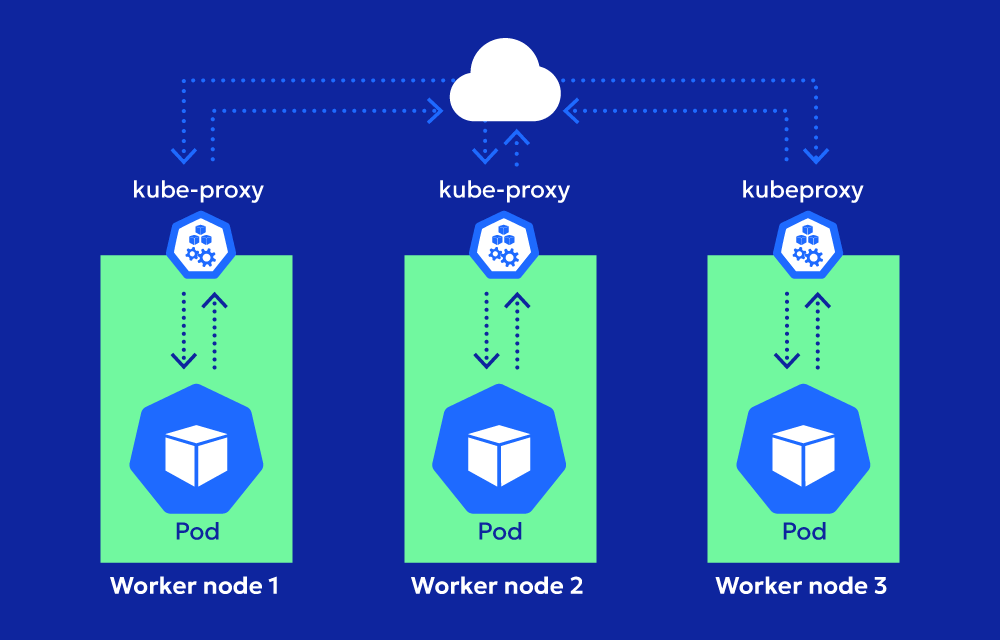
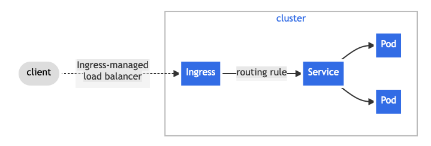
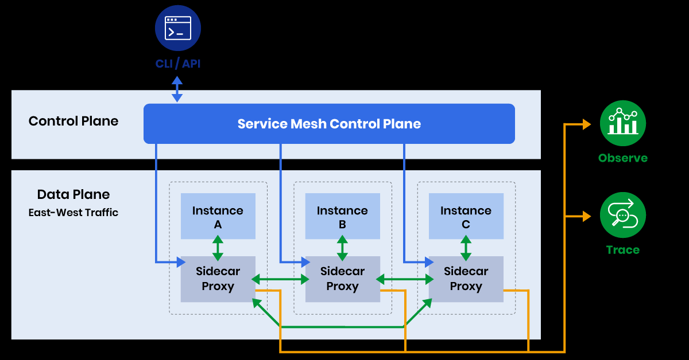

Kubernetes Networking Interview Questions and Answers (NEW)
This file contains Kubernetes networking interview questions and answers, designed for DevOps interviews.

Questions and Answers

---

1. What is networking in Kubernetes, and why is it important?
Networking in Kubernetes is how pods, containers, and services talk to each other and to outside systems. It makes sure pods on different nodes can communicate, services can send traffic to the right pods, and external users can access applications. It handles things like giving pods IP addresses, balancing traffic, and keeping connections secure.
Why is it important? Without good networking, applications in Kubernetes cannot work together or reach users. For example, in an e-commerce website, networking lets the shopping cart service talk to the payment service, and it lets customers access the website through their browsers. It keeps applications fast, reliable, and safe.

---

2. What is a pod network in Kubernetes?
A pod network gives each pod a unique IP address in a Kubernetes cluster. All containers in a pod share this IP and can talk to each other using localhost. The pod network lets pods on different nodes communicate as if they were on the same machine.
For example, in a SaaS platform, a pod running a user login service can send data to a pod running a database service on another node. The pod network, set up by a Container Network Interface (CNI) plugin like Calico or Flannel, makes this communication smooth and reliable.
!(pod-ip.png)

---

3. What is a ClusterIP Service, and how does it work?
A ClusterIP Service gives pods a stable internal IP address for communication inside the cluster. It creates a virtual IP that sends traffic to a group of pods, chosen by labels. This IP is only accessible within the cluster, not from outside.
How it works: When you create a ClusterIP Service, Kubernetes assigns a virtual IP. The kube-proxy component on each node sets up rules to send traffic from this IP to the right pods. For example, in a fintech app, a ClusterIP Service named payment-service sends requests from a frontend pod to backend payment pods, keeping communication reliable.

---

4. What is a NodePort Service, and when is it used?
A NodePort Service opens a specific port on every node in the cluster to let external traffic reach pods. The port is usually between 30000 and 32767. Users can access the service by sending requests to any node’s IP address and the assigned port.
When is it used? NodePort is useful for testing or when you need quick external access without a load balancer. For example, in a gaming platform, a NodePort Service lets players connect to a game server pod at node-ip:30001 during development. In production, LoadBalancer or Ingress is better for scalability.

---

5. What is a LoadBalancer Service, and how is it different from NodePort?
A LoadBalancer Service exposes pods to external traffic using a cloud provider’s load balancer, like AWS ELB or Google Cloud Load Balancer. It gives an external IP address that sends traffic to the pods, usually through a ClusterIP and node ports internally.
Difference from NodePort: NodePort uses a fixed port on every node’s IP, which can be hard to manage and scale. LoadBalancer gives a single, stable external IP managed by the cloud provider. For example, in an e-commerce platform, a LoadBalancer Service exposes the checkout page to customers, spreading traffic across multiple checkout pods for reliability.

---

6. What is kube-proxy, and what does it do for networking?
Kube-proxy is a program that runs on every node in a Kubernetes cluster. It manages network rules to let pods, services, and external systems communicate. It uses tools like iptables or IPVS to route traffic based on Service definitions.
What it does: Kube-proxy makes sure requests to a Service’s virtual IP, like a ClusterIP, reach the correct pods. It also balances traffic across multiple pods. For example, in a social media app, kube-proxy sends user requests to a ClusterIP Service for the profile page, spreading traffic evenly across profile pods.

---

7. What is a Container Network Interface (CNI) plugin?
A CNI plugin is software that sets up networking for pods in a Kubernetes cluster. It gives pods IP addresses, sets up routes, and ensures pods can talk across nodes. Kubernetes supports CNI plugins like Calico, Flannel, Weave Net, and Cilium.
For example, in a logistics app, the Calico CNI plugin gives unique IPs to pods running tracking services and sets up network policies to secure communication. The plugin works with the cluster’s network to make communication fast and reliable.

---

8. How does Kubernetes give IP addresses to pods?
Kubernetes gives each pod a unique IP address using the CNI plugin set up in the cluster. When a pod is created, the CNI plugin picks an IP from a range called the pod CIDR. All containers in the pod share this IP, and pods can talk to each other using these IPs, even across nodes.
For example, in a cloud-native CRM system, a pod running the customer service API gets an IP like 10.244.1.5, and a database pod gets 10.244.2.7. The CNI plugin ensures they can communicate directly without complex routing.

---

9. What is a Service in Kubernetes, and why do we need it?
A Service is a Kubernetes object that gives a stable way to access a group of pods, usually chosen by labels. Pods can be created or deleted, so their IPs change. A Service provides a fixed IP (ClusterIP) or DNS name to reach these pods reliably.
Why needed? Services help with load balancing, finding pods, and communication without using changing IPs. For example, in a streaming platform, a Service named video-service sends user requests to video processing pods, even if some pods crash and are replaced.

---

10. What is an Ingress, and how does it work?
An Ingress is a Kubernetes object that manages external HTTP or HTTPS traffic to Services, using domain names or URL paths to route traffic. It works with an Ingress Controller, like Nginx or Tra insomma, to handle the routing based on rules in the Ingress resource.
How it works: The Ingress Controller listens for external requests and uses the Ingress rules to send them to the right Service. For example, in an e-commerce site, an Ingress sends store.example.com/cart to the cart Service and store.example.com/payment to the payment Service, using a single external IP.

---

11. How is Ingress different from a LoadBalancer?
Ingress and LoadBalancer both let external traffic reach pods, but they work differently. A LoadBalancer Service creates a cloud provider load balancer with one external IP that sends traffic to one Service. Ingress uses one external IP to send traffic to multiple Services based on domain names or URL paths, needing an Ingress Controller.
For example, in a SaaS app, a LoadBalancer exposes the main API Service with one IP. An Ingress routes app.example.com/api to the API Service and app.example.com/docs to a documentation Service, saving resources with one IP.

---

12. What is a network policy in Kubernetes?
A network policy is a Kubernetes resource that controls which pods can talk to each other. It sets rules for incoming (ingress) and outgoing (egress) traffic based on pod labels, namespaces, or IP ranges. These rules are enforced by the CNI plugin, like Calico or Cilium.
For example, in a fintech platform, a network policy allows only payment Service pods to talk to database pods, blocking other pods for security. This keeps sensitive data safe.

---

13. How does DNS work in Kubernetes?
Kubernetes runs an internal DNS service, usually CoreDNS, that gives DNS names to Services and pods. Each Service gets a name like <service-name>.<namespace>.svc.cluster.local, which pods use to communicate instead of IPs. DNS turns the Service name into its ClusterIP, which routes to the pods.
For example, in a logistics app, a tracking Service reaches a database Service using db-service.default.svc.cluster.local. This ensures communication works even if pod IPs change.

---

14. What does CoreDNS do in Kubernetes?
CoreDNS is the default DNS server in Kubernetes. It resolves DNS names for Services and pods, letting them communicate using names instead of IPs. CoreDNS runs as a pod in the kube-system namespace and handles all DNS queries in the cluster.
For example, in an e-commerce platform, when a frontend pod sends a request to backend-service.default.svc.cluster.local, CoreDNS turns it into the backend Service’s ClusterIP, making communication smooth.

---

15. What is a headless Service, and when do we use it?
A headless Service is a Service without a ClusterIP. Instead of giving a single virtual IP, it returns the IPs of all pods matching the Service’s selector when queried via DNS. It is used when you need to access individual pod IPs directly, not through load balancing.
When used? For stateful applications like databases where pods need direct connections. For example, in a SaaS platform, a headless Service for a MongoDB cluster lets clients connect directly to specific replica pods for reading data.

---

16. How do ClusterIP, NodePort, and LoadBalancer Services differ?
ClusterIP, NodePort, and LoadBalancer are Kubernetes Service types with different uses:

ClusterIP: Gives a virtual IP for internal pod communication, like a frontend pod talking to a backend pod in an e-commerce app.
NodePort: Opens a port on every node’s IP for external access, useful for testing, like exposing a game server pod during development.
LoadBalancer: Creates a cloud provider load balancer with an external IP, used in production, like exposing a payment gateway in a fintech app.

Each type fits different needs, with LoadBalancer being best for production external traffic.

---

17. How does kube-proxy use iptables for networking?
Kube-proxy uses iptables to set up network rules that route traffic to Services and pods. When a Service is created, kube-proxy creates iptables rules on each node to map the Service’s ClusterIP and port to the IPs and ports of the target pods. It also balances traffic across pods.
For example, in a social media app, kube-proxy sets iptables rules to send requests to a ClusterIP Service for the newsfeed to multiple newsfeed pods, ensuring even traffic distribution.

---

18. What is IPVS, and how is it different from iptables in kube-proxy?
IPVS (IP Virtual Server) is another mode for kube-proxy to handle Service traffic. Unlike iptables, which uses kernel rules, IPVS uses a faster kernel-level load balancing system built for high traffic. IPVS supports advanced algorithms like round-robin or least connections.
Difference: IPVS is more efficient and scales better for large clusters with many Services. For example, in a streaming platform with thousands of users, IPVS ensures smoother traffic distribution to video pods than iptables.

---

19. What is a pod’s network namespace?
A pod’s network namespace is a Linux feature that isolates the pod’s networking environment. All containers in a pod share this namespace, so they use the same IP address, port space, and network stack. This lets containers talk to each other via localhost.
For example, in a web app, a pod with an Nginx container and a logging sidecar container shares a network namespace. The logging container can access Nginx logs via localhost without external routing.

---

20. How does Kubernetes handle external-to-internal traffic?
Kubernetes handles external-to-internal traffic using three methods:

NodePort: Opens a port on each node’s IP to let external users reach pods.
LoadBalancer: Creates a cloud provider load balancer to route external traffic to pods.
Ingress: Routes HTTP/HTTPS traffic to Services based on domain or path rules.

For example, in a fintech app, an Ingress sends user requests to app.example.com/login to the login Service, while a LoadBalancer exposes an API endpoint for third-party integrations.

---

21. What is an Ingress Controller, and why do we need it?
An Ingress Controller is a pod that processes Ingress rules to route external HTTP or HTTPS traffic to Services. Kubernetes does not include a built-in Ingress Controller, so you must deploy one, like Nginx, Traefik, or HAProxy. The controller reads Ingress resources and sets up routing.
Why needed? Ingress resources are just definitions; the controller makes them work by handling traffic. For example, in an e-commerce site, an Nginx Ingress Controller sends store.example.com/cart to the cart Service and store.example.com/orders to the orders Service.

---

22. How do you troubleshoot network issues in Kubernetes?
To troubleshoot network issues in Kubernetes, follow these steps:

Check pod status with kubectl get pods and kubectl describe pod <name> to see if pods are running.
View logs with kubectl logs <pod-name> to check for application errors.
Verify Service setup with kubectl describe service <name> to check selectors and ports.
Test DNS with kubectl exec <pod-name> -- nslookup <service-name> to ensure CoreDNS works.
Check network policies with kubectl get networkpolicy to see if traffic is blocked.
Inspect nodes with kubectl get nodes and kubectl describe node <name> for network issues.

For example, in a SaaS app, if a frontend pod cannot reach a backend Service, you might find a wrong selector in the Service using kubectl describe service.

---

23. What is a Service mesh, and how does it help networking?
A Service mesh is a system that manages communication between Services in a Kubernetes cluster. It uses sidecar proxies, like Envoy in Istio, to handle traffic, adding features like load balancing, encryption, and monitoring without changing application code.
How it helps: It makes complex networking tasks easier, like retrying failed requests or securing connections. For example, in a fintech platform, Istio’s Service mesh encrypts traffic between payment and database Services and tracks traffic for performance.

---

24. How do network policies secure Kubernetes clusters?
Network policies secure clusters by controlling which pods can send or receive traffic. They use rules based on pod labels, namespaces, or IP ranges to allow or block traffic. These rules are enforced by the CNI plugin, like Calico.
For example, in a healthcare app, a network policy allows only the patient data Service to talk to the database pods, blocking other pods to protect sensitive information. This ensures only authorized pods can communicate.

---

25. What is the difference between ingress and egress in network policies?
In network policies, ingress and egress define traffic direction:

Ingress: Controls incoming traffic to a pod. For example, allowing only specific pods to send requests to a database pod.
Egress: Controls outgoing traffic from a pod. For example, allowing a pod to send requests only to specific external APIs.

For example, in a fintech app, an ingress policy lets only payment pods talk to a database pod, while an egress policy lets the database pod send data only to a backup service, improving security.

---

26. What is the role of the kube-dns service in Kubernetes networking?  
The kube-dns service is responsible for providing DNS resolution within a Kubernetes cluster. It allows pods and Services to communicate using DNS names instead of IP addresses. kube-dns ensures that each Service has a DNS name, such as `<service-name>.<namespace>.svc.cluster.local`, which resolves to the Service's ClusterIP.  

For example, in a microservices architecture, a frontend pod can reach a backend Service using its DNS name, like `backend-service.default.svc.cluster.local`, even if the backend pods are replaced and their IPs change.  

---

27. How does Kubernetes handle network traffic between nodes?  
Kubernetes handles network traffic between nodes using the pod network, which is set up by the CNI plugin. The plugin ensures that pods on different nodes can communicate as if they were on the same machine. Kubernetes also uses kube-proxy to route traffic between nodes based on Service definitions.  

For example, in a distributed application, a pod running on Node A can send data to a pod on Node B using the pod's IP address, with the CNI plugin managing the routing and kube-proxy ensuring traffic reaches the correct Service.  

---

28. What is the purpose of a ServiceAccount in Kubernetes networking?  
A ServiceAccount is a Kubernetes resource that provides an identity for pods to interact with the cluster's API and other resources securely. It is used to assign permissions and credentials to pods for accessing Services, secrets, or external APIs.  

For example, in a CI/CD pipeline, a pod running a build job can use a ServiceAccount to access a private Docker registry securely, ensuring the pod has the necessary permissions without exposing sensitive credentials.  

---

29. How does Kubernetes handle network isolation between namespaces?  
Kubernetes isolates network traffic between namespaces using network policies. By default, pods in different namespaces can communicate, but network policies can restrict traffic based on namespaces, pod labels, or IP ranges.  

For example, in a multi-tenant SaaS platform, network policies can block pods in the `tenant-a` namespace from accessing pods in the `tenant-b` namespace, ensuring data isolation and security for each tenant.  

---

30. What is the role of the kubelet in Kubernetes networking?  
The kubelet is a Kubernetes agent that runs on each node and manages pod lifecycle and communication. In networking, the kubelet interacts with the CNI plugin to set up pod networking, including assigning IP addresses and configuring routes.  

For example, when a new pod is created, the kubelet ensures the pod gets a unique IP address from the pod CIDR and sets up the necessary network configuration for the pod to communicate with other pods and Services.  

---